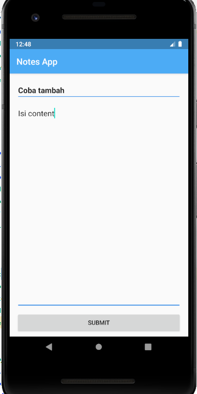

# Screenshot Tampilan Notes App

1. Halaman Splashscreen 
---

2. Halaman Get Started
---

3. Halaman Welcome
---

4. Halaman Simpan Notes
---

5. Validasi Input pada Simpan Notes
---

6. Contoh Halaman jika telah Membuat beberapa notes
---
